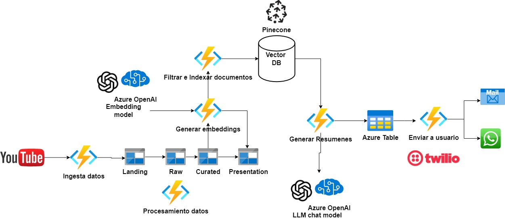
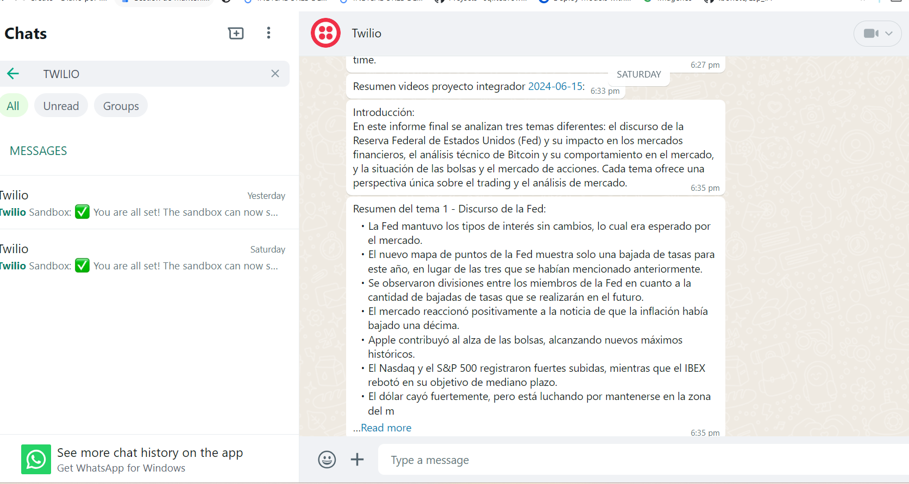
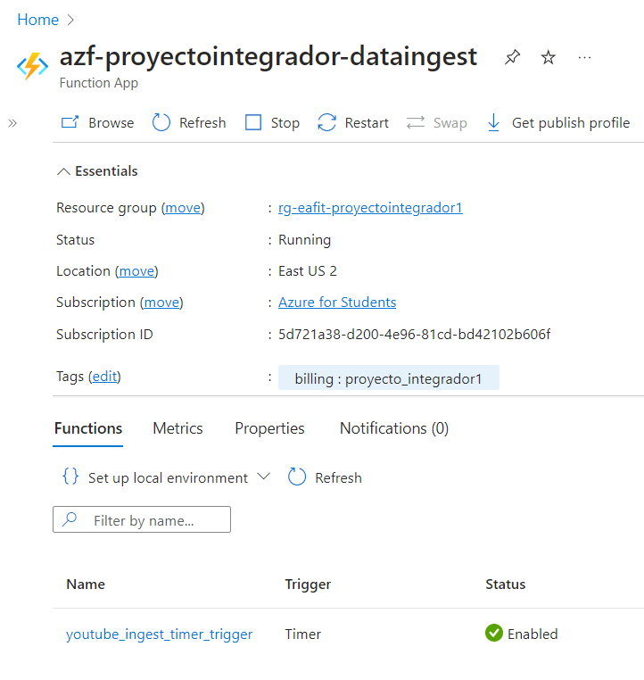
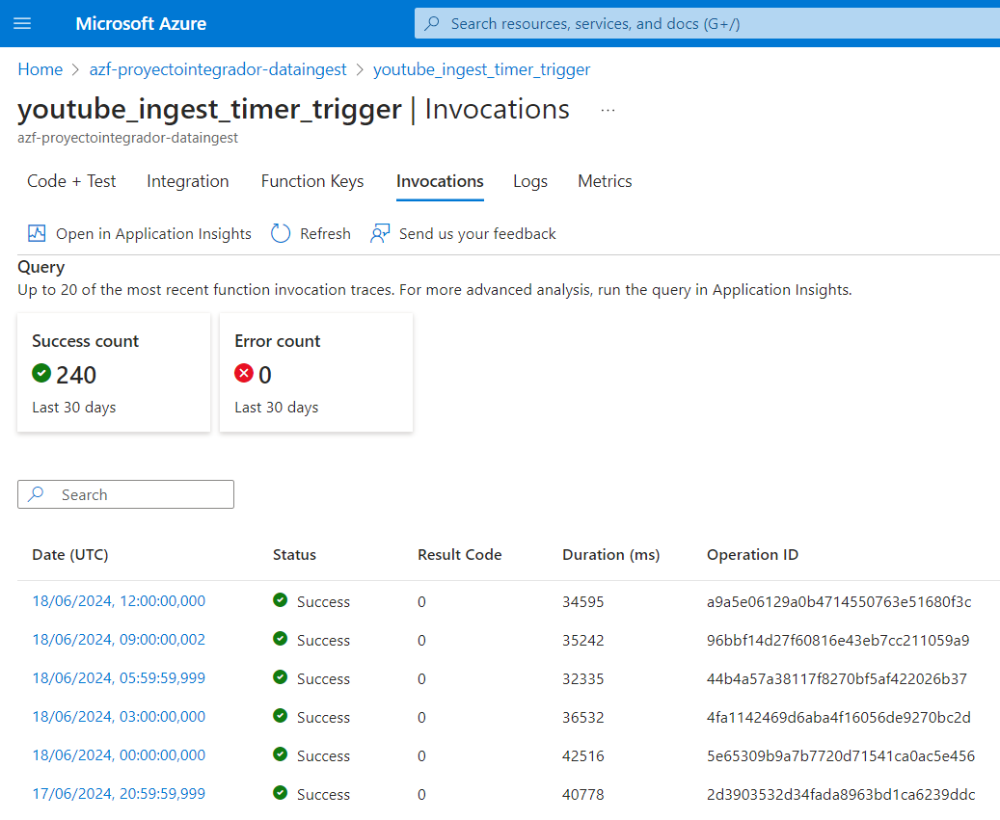
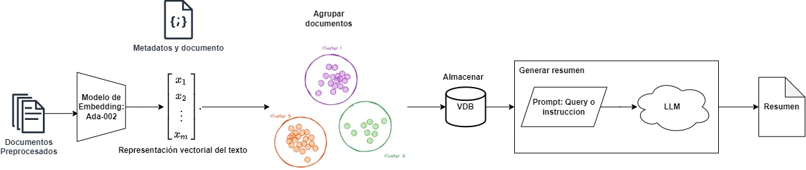
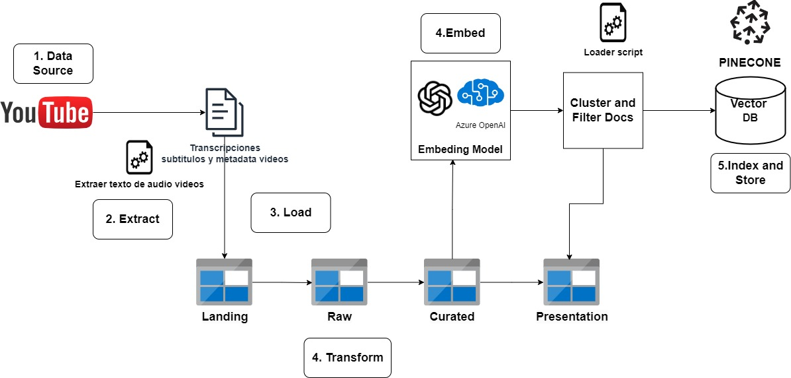
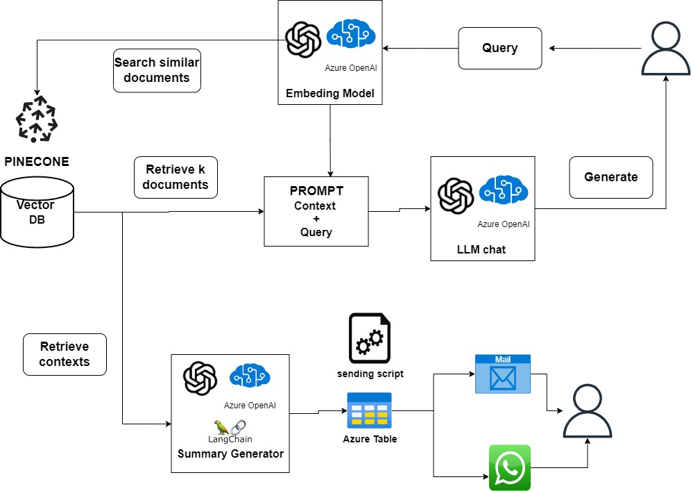
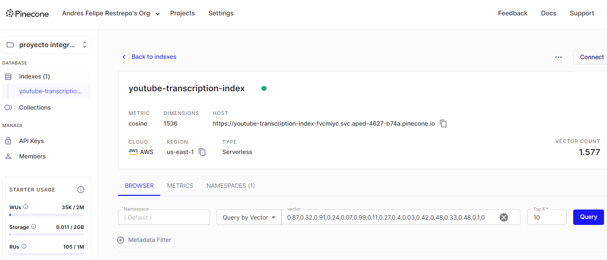

# Proyecto-integrador
Proyecto integrador primer semestre maestría en ciencia de datos

## Arquitectura

## Estructura del Proyecto

- [aplicacion](#aplicacion)
- [ingesta_datos](#ingesta_datos)
- [modelamiento](#modelamiento)
- [Procesamiento_datos_almacenamiento_y_recuperacion_texto](#Procesamiento_datos_almacenamiento_y_recuperacion_texto)

## [aplicacion](aplicacion)

Envio de resumenes a whatsapp [ir](aplicacion).

Tablas de resumenes de videos [ver tabla resumen videos](data/VideoSummaryTable.csv) y resumenes generales de todos los videos por dia (Map reduce). [ver tabla resumen diario](data/GeneralSummaryTable.csv)

## [Ingesta_datos](ingesta_datos)

Ingesta de transcripciones y metadata de videos de canales de youtube (Cada 3 horas). [Ver dataset](https://huggingface.co/datasets/AndresR2909/youtube_transcriptions_ingest)

## [Modelamiento](modelamiento)

Exploracion de modelos de ML para hacer agrupacion de embeddings con el objetivo agregar metadata de topicos y filtar textos (chunks) no relevantes para el almacenamiento en base de datos vectorial. [ver dataset](https://huggingface.co/datasets/AndresR2909/youtube_transcripcions_embeddigns)

* LDA
* Reduccion dimensionalidad: PCA, TSNE, UMAP
* Clustering: Kmeans, Dbscan, Hdbscan

## [Procesamiento_datos_almacenamiento_y_recuperacion_texto](procesamiento_datos_almacenamiento_recuperacion_texto)

Procesamiento de documentos, generacion de chunks, embbedings y almacenamiento en base de datos vectorial. [ver dataset](https://huggingface.co/datasets/AndresR2909/youtube_transcripcions_vector_data_base)

Recuperacion de texto de base de datos vectorial para generacion de resumenes

Base de datos vectorial: Pinecone

